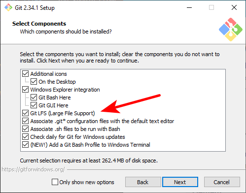
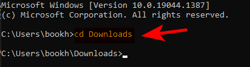
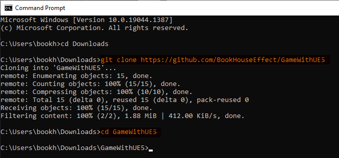

# Project "Game"

## Intro

This repository contains project created in Unreal Engine 5.0EA. For more details about the game engine please visit the following [link](https://www.unrealengine.com/en-US/).

This git repository uses [Git LFS (Large File Support)](https://www.atlassian.com/git/tutorials/git-lfs), i.e. the real files are stored on a disk drive, and the visible files contain some reference ID related to the disk. **Thus downloading this repository by clicking the download button, will download the files containing the reference ID, rather than the real files.** You should CLONE IT.

```*--- DO NOT DOWNLOAD BY CLICKING THE DOWNLOAD BUTTON ---*```

## CLONING the repository locally

1. Firstly you should ensure that you have download [GIT](https://git-scm.com/downloads) on you local machine. You can download it from this link https://git-scm.com/downloads.

1. Next thing install git on you computer. When installing git ensure you have selected *Git LFS* option (**This is important**). Leave the rest of the options with default selections.

    

1. After sucessfully installing git, open [Command Prompt (CMD)](https://www.lifewire.com/how-to-open-command-prompt-2618089) on Windows, or you terminal of choice on other operating systems.

1. Go to the folder where you would like to clone the repository (ex. Downloads), using the **cd** command:

    

1. Now execute the the following command to download the repository:

    `git clone https://github.com/BookHouseEffect/GameWithUE5`

1. Wait for the download to finish. Get into the newly created folder "GameWithUE5", and you can open the project with UE5.

    

## Retrieving the NEW changes after the repository is CLONED

1. Once the repository is cloned, you do not need to clone it again to get the new changes. You can use "git pull" command for this action. But you need to be inside the "GameWithUE5" folder. You can learn more about git using this [link](https://www.tutorialspoint.com/git/index.htm).